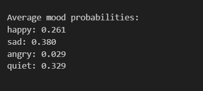
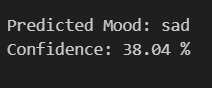

<h1 align="center"> AI Music Composer (Mood-Based)</h1>

An AI-based system that generates original music conditioned on emotional mood using deep learning on symbolic MIDI data.

<h2> Overview</h2>

This project implements a <b>mood-based AI music composer</b> that learns musical patterns from MIDI files and generates
new melodies based on selected emotions such as <b>happy, sad, angry, and quiet</b>.

To evaluate the generated music, a separate <b>mood classification model</b> is used, forming a complete
<b>generation + validation pipeline</b>.

<h2> Key Features</h2>
<ul>
  <li>Mood-conditioned music generation using LSTM</li>
  <li>Symbolic (MIDI-based) music representation</li>
  <li>Independent mood classifier for automatic validation</li>
  <li>End-to-end AI pipeline: data → generation → evaluation</li>
  <li>CPU-only compatible (no GPU dependency)</li>
</ul>

<h2> Project Structure</h2>

<pre>
Ai_Music_Composer/
│
├── data/
│   ├── Raw_midi/              # Original MIDI dataset
│   ├── reduced_midi/          # Balanced subset per mood
│
├── training_data/
│   ├── X.pkl                  # Input note sequences
│   ├── y.pkl                  # Target next notes
│   ├── mood_labels.pkl        # Mood labels
│
├── artifacts/
│   ├── note_to_idx.pkl        # Note vocabulary mapping
│
├── models/
│   ├── mood_classifier.h5     # Trained mood classifier
│   ├── music_generator_cpu.h5 # Trained music generator
│
├── generated_music/
│   ├── sad_generated.mid      # Example generated output
│
├── notebooks/
│   ├── 01_dataset_reduction.ipynb
│   ├── 02_data_preparation.ipynb
│   ├── 03_sequence_generation.ipynb
│   ├── 04_mood_classifier.ipynb
│   ├── 05_music_generator_cpu.ipynb
│   ├── 06_generate_music.ipynb
│   ├── 06_5_validate_generated_music.ipynb
│
│── README.md
└──requirements.txt
</pre>

<h2> Dataset</h2>
<ul>
  <li>Symbolic MIDI music dataset</li>
  <li>Each file labeled with mood in its filename</li>
  <li>Four moods used:
    <ul>
      <li>happy</li>
      <li>sad</li>
      <li>angry</li>
      <li>quiet</li>
    </ul>
  </li>
</ul>

During preprocessing:

<ul>
  <li>Very short MIDI files were removed</li>
  <li>Dataset was balanced across moods</li>
  <li>Only pitch-based note sequences were extracted</li>
  <li>Drum tracks were ignored</li>
</ul>

<h2> Model Architecture</h2>

<h3> Music Generator</h3>
<ul>
  <li>Note embedding layer</li>
  <li>Mood embedding layer</li>
  <li>Mood-conditioned LSTM</li>
  <li>Softmax output for next-note prediction</li>
</ul>

<h3> Mood Classifier</h3>
<ul>
  <li>Note embedding layer</li>
  <li>LSTM-based sequence encoder</li>
  <li>Softmax output for mood prediction</li>
</ul>

Both models operate purely on <b>symbolic note sequences</b> and are independent of instrument type.

<h2> How to Run the Project</h2>

<h3>Step 1–3: Data Preparation</h3>
<pre>
01_dataset_reduction.ipynb
02_data_preparation.ipynb
03_sequence_generation.ipynb
</pre>

<h3>Step 4: Train Mood Classifier</h3>
<pre>
04_mood_classifier.ipynb
</pre>

Produces:

<pre>
models/mood_classifier.h5
</pre>

<h3>Step 5: Train Music Generator (CPU)</h3>
<pre>
05_music_generator_cpu.ipynb
</pre>

Produces:

<pre>
models/music_generator_cpu.h5
</pre>

<h3>Step 6: Generate Music</h3>
<pre>
06_generate_music.ipynb
</pre>

Example:

<pre>
mood = "sad"
</pre>

Output:

<pre>
generated_music/sad_generated.mid
</pre>

<h3>Step 6.5: Validate Generated Music</h3>
<pre>
06_5_validate_generated_music.ipynb
</pre>

The generated MIDI is converted back into note sequences and evaluated using the trained mood classifier.

<h2> Example Result (Sad Music Validation)</h2>

<b>Input mood for generation:</b>

<pre>sad</pre>

<b>Average mood probabilities predicted by the classifier:</b>

  

<b>Final prediction:</b>

  

The classifier predicts <b>sad</b> as the dominant mood for the generated music.
The confidence score reflects realistic emotional overlap commonly observed
in symbolic music-based mood classification.

<h2> Interpretation of Results</h2>
<ul>
  <li>Music generation is probabilistic, not deterministic</li>
  <li>Emotional overlap between moods is natural in music</li>
  <li>Mixed confidence reflects realistic emotional ambiguity</li>
  <li>Correct alignment (e.g., sad → sad) validates the system</li>
</ul>

<h2> Installation & Dependencies</h2>

All required Python packages for this project are listed in the
<b><code>requirements.txt</code></b> file.
This ensures a consistent and reproducible environment.

<h3> Setup Instructions</h3>

<ol>
  <li>Create and activate a virtual environment (recommended):</li>
</ol>

<pre>
python -m venv venv
venv\Scripts\activate
</pre>

<ol start="2">
  <li>Install all required dependencies using the requirements file:</li>
</ol>

<pre>
pip install -r requirements.txt
</pre>

This command automatically installs all necessary libraries including
TensorFlow, NumPy, and MIDI processing tools.

<h3> Notes</h3>
<ul>
  <li>GPU acceleration was <b>avoided</b> due to early framework support limitations for <b>RTX 50-series GPUs</b>.</li>
  <li>The implementation remains GPU-compatible for future releases.</li>
  <li>Piano-only output is intentional and compatible with the classifier.</li>
</ul>

<h2> Conclusion</h2>

This project demonstrates a complete <b>AI-driven music composition system</b> capable of generating and validating
mood-based music using deep learning on symbolic MIDI data.

